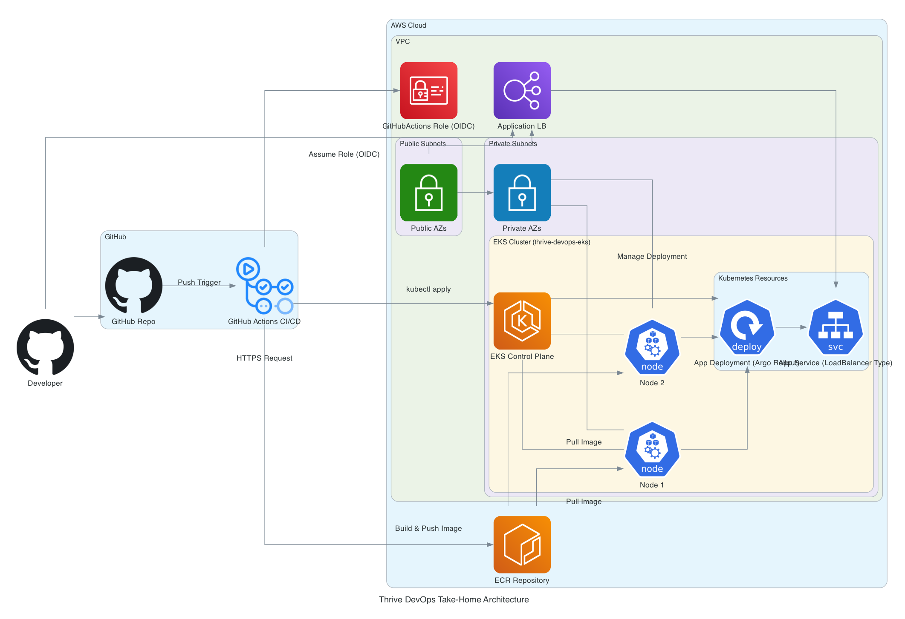

# 🚨 **Evaluator Guidance** 🚨
<div style="border: 2px solid #ff9800; background-color: #fff3cd; padding: 16px; border-radius: 8px; margin-bottom: 24px;">
👉 <b>Please start with the <a href="EVALUATOR.md">Evaluator Quickstart Guide</a> for a focused walkthrough tailored for reviewers and graders.</b>
<br>
<br>
This guide summarizes exactly what to do, what to look for, and how to verify the solution—no guesswork required.
</div>

# 🌱 Thrive DevOps & MLOps Project

Welcome! This document provides everything you need to quickly replicate, deploy, and validate the Thrive DevOps infrastructure, application, and monitoring stack.

---

## 📖 Table of Contents

- [🚨 **Evaluator Guidance** 🚨](#-evaluator-guidance-)
- [🌱 Thrive DevOps \& MLOps Project](#-thrive-devops--mlops-project)
  - [📖 Table of Contents](#-table-of-contents)
  - [📐 Architecture Overview](#-architecture-overview)
  - [🚀 Quick Start Guide](#-quick-start-guide)
  - [🛠️ CI/CD Pipeline](#️-cicd-pipeline)
  - [📊 Monitoring \& Alerting](#-monitoring--alerting)
  - [🔒 Secrets Management](#-secrets-management)
  - [🔐 TLS Setup](#-tls-setup)
  - [📚 Key Decisions \& Trade-offs](#-key-decisions--trade-offs)
  - [❗ Troubleshooting](#-troubleshooting)

---

## 📐 Architecture Overview

The diagram below outlines the key components and their interactions within the deployed infrastructure. For detailed rationale behind specific choices, please refer to the [Architecture Decision Records (ADRs)](docs/ADRs/).



---

## 🚀 Quick Start Guide

Follow these **exact** steps to provision and deploy the entire solution.
> With prerequisites installed, end-to-end wall-clock time ≈ 25 min. AWS creates EKS in the background (~18 mins) while you complete GitHub & secret steps in parallel.
(Optional steps include exploring Grafana and Argo Rollouts.)

**Assumptions:** You are running macOS with Homebrew installed.

**1. Prerequisites (2 mins)**

- Ensure you have an AWS account with appropriate permissions (similar to admin, or sufficient to create VPC, EKS, IAM Roles/Policies, ECR, Load Balancers, etc.).
- Install required CLI tools:
  ```bash
  brew install awscli kubectl helm terraform
  brew install argoproj/tap/kubectl-argo-rollouts # Installs Argo Rollouts Kubectl plugin
  ```
-> **Note:** Homebrew might take 5-10 minutes if it needs to install large dependencies like Xcode Command Line Tools. If tools are already installed, it will be much faster.
- Configure AWS CLI with your credentials. Ensure you target the intended region (e.g., `us-east-1`):
  ```bash
  aws configure
  # Enter Access Key ID, Secret Access Key, Default region name, Default output format
  ```
  > **Note:** The Quick Start assumes the `us-east-1` region; update as needed.

**1a. Create GitHub OIDC Provider and IAM Role (5 mins)**

First, establish trust between your AWS account and GitHub Actions using IAM OIDC. Then, create the specific IAM Role GitHub Actions will assume.

> **Note:** This step involves manual creation of the OIDC provider and the `GitHubActions-ThriveDevOpsRole` using the AWS CLI. **This specific role is NOT managed by Terraform** due to the OIDC trust configuration requirements. Terraform will manage other roles needed by the infrastructure (e.g., for EKS node groups).

1.  **Create OIDC Provider:** In the AWS IAM console, add `token.actions.githubusercontent.com` as an OpenID Connect identity provider.
2.  **Create IAM Role:** Create an IAM role (`GitHubActions-ThriveDevOpsRole` or similar) that trusts the OIDC provider. Attach necessary permissions (e.g., `AmazonEC2ContainerRegistryPowerUser`, `AmazonEKSClusterPolicy`, plus permissions for Secrets Manager if using External Secrets).
3.  **Get Role ARN:** Copy the ARN of the created role. You'll need it for GitHub Secrets.

    **Verify Role ARN using AWS CLI (Recommended):**
    ```bash
    # Replace 'YourRoleName' with the actual name you used
    aws iam get-role --role-name GitHubActions-ThriveDevOpsRole --query Role.Arn --output text
    ```
    > **Important:** Record the **exact ARN** output by this command. You will paste this into GitHub Secrets later. Do *not* rely on example ARNs.

**What's Happening?** This establishes a secure, passwordless trust mechanism allowing GitHub Actions workflows to assume an IAM role in your AWS account.

**2. Clone Repository (1 min)**

```bash
git clone https://github.com/hey-tommy/thrive-devops-takehome.git # Replace with your fork if applicable
cd thrive-devops-takehome
```

**3. Provision Infrastructure with Terraform (15-18 mins)**

Navigate to the Terraform directory and apply the configuration. This provisions the core AWS resources: VPC, EKS Cluster, ECR Repository, and related IAM roles (excluding the manually created `GitHubActions-ThriveDevOpsRole`).

> **Note:** Terraform can optionally manage the AWS Load Balancer Controller Helm release via `variable "enable_aws_lb_controller"`. **This project uses the default Kubernetes Service LoadBalancer and does not enable the AWS Load Balancer Controller by default** (See [ADR-001](docs/ADRs/001-canary-eks-rationale.md) for context on deployment strategies).

```bash
cd infra/terraform
```

Initialize Terraform:
```bash
terraform init
```

Apply the Terraform configuration. This will provision the VPC (See [ADR-002](docs/ADRs/002-vpc-nat-vs-public.md)), EKS cluster, ECR repository, IAM roles (including the one for GitHub Actions), and other necessary resources. Review the plan carefully before confirming.
```bash
terraform apply -auto-approve
# Review the plan, then type 'yes' to approve
```

-**⚠️ Important:** Note the outputs, especially `eks_cluster_name` and `github_actions_role_arn`. You will need these shortly. This step will incur AWS costs.
-**⏳ Wait Time:** This step typically takes **15-18 minutes**, primarily for EKS control plane provisioning. Actual time may vary slightly based on AWS region load.
-**🚀 Parallel Step:** While Terraform runs, you can proceed to **Step 4: Configure GitHub Secrets** in a separate terminal tab.
- Copy the `eks_cluster_name` and `github_actions_role_arn` values printed at the end of the run—you will paste them in later steps.
- If you plan to keep the cluster longer than a demo, consider enabling the AWS Load Balancer Controller (optional; documented in `docs/ADRs/001-canary-eks-rationale.md`).

**What's Happening?** This step uses Terraform to provision the core AWS infrastructure: VPC (See [ADR-002](docs/ADRs/002-vpc-nat-vs-public.md)), EKS Cluster, EKS Node Groups (via Auto Scaling Groups), and an ECR repository.

> **Note:** Terraform will NOT remove manually created resources (GitHub OIDC provider, IAM roles from Step 1a). These must be manually deleted separately during cleanup.

**Tip:** Terraform apply takes 15-18 minutes, mostly waiting for EKS cluster creation. **To save significant time and reliably meet the ~30 min target, proceed to Step 4 (Configure GitHub Secrets) in a separate terminal *while* Terraform is running.** Performing these steps in parallel is key.

**4. Configure GitHub Secrets and kubectl (5 mins)**

> **Optional Sanity Check:** Before proceeding, double-check that your AWS CLI is configured for the correct region (`aws configure get region`) and that the IAM role created in Step 1a has the necessary permissions (e.g., ECR Push, EKS access).

Retrieve values via:
```bash
terraform output -raw github_actions_role_arn
```  

Go to your repository's `Settings → Secrets and variables → Actions` and add the following repository secrets:
| Secret Name               | Value                                                               | Required | Notes                                       |
|---------------------------|---------------------------------------------------------------------|----------|---------------------------------------------|
| `AWS_REGION`              | The AWS region you deployed to (e.g., `us-east-1`)                  | Yes      | Used by Terraform & GitHub Actions          |
| `AWS_GITHUB_ACTIONS_ROLE` | The **exact Role ARN output** from the `aws iam get-role` command in **Step 1a** | Yes      | Used by GitHub Actions for OIDC credentials |
| `SLACK_BOT_TOKEN`         | Your Slack bot token (`xoxb-...`)                                   | No       | Only needed for optional Slack alerts       |
| `SLACK_CHANNEL_ID`        | Your Slack channel ID (`C...`)                                      | No       | Only needed for optional Slack alerts       |
| `SLACK_WEBHOOK_URL`       | Your Slack Incoming Webhook URL (`https://hooks.slack.com/...`)     | No       | Used by Prometheus/Alertmanager for alerts|

[Follow GitHub’s official guide](https://docs.github.com/en/actions/security-guides/using-secrets-in-github-actions) if unfamiliar with setting repository secrets.

Create the demo secret in AWS Secrets Manager that the application will consume via External Secrets Operator (See [ADR-006](docs/ADRs/006-kubernetes-external-secrets.md)).

> **Note:** Terraform does NOT provision the individual secrets within AWS Secrets Manager. You must explicitly create the secret named `thrive-devops/demo-app-secrets` and populate it with the required key-value pair manually using the AWS CLI or console.

```bash
aws secretsmanager create-secret \
  --name thrive-devops/demo-app-secrets \
  --secret-string '{"GREETING":"Hello from Secrets Manager!"}'
```

Configure `kubectl` to connect to your new EKS cluster. Replace `<YOUR_AWS_REGION>` and `<YOUR_EKS_CLUSTER_NAME>` with your values (e.g., `us-east-1` and `thrive-devops-eks` from Terraform output).
```bash
aws eks update-kubeconfig --region <YOUR_AWS_REGION> --name <YOUR_EKS_CLUSTER_NAME>
```

Verify cluster access:
```bash
kubectl get nodes
# You should see the EKS worker nodes
```
If you do **not** see nodes, wait 60 seconds and retry—​EKS API propagation can lag.

**5. Install Argo Rollouts Controller (1 min)**

Install the Argo Rollouts controller into your cluster, which manages the progressive deployment strategy:
```bash
kubectl create namespace argo-rollouts
kubectl apply -n argo-rollouts -f https://github.com/argoproj/argo-rollouts/releases/latest/download/install.yaml
```
Wait until the controller Deployment reports `Available` status:
```bash
kubectl -n argo-rollouts wait deploy/argo-rollouts --for=condition=Available --timeout=120s
```

**6. Install External Secrets Operator (1 min)**

Install the External Secrets Operator, which syncs secrets from AWS Secrets Manager into Kubernetes:
```bash
helm repo add external-secrets https://charts.external-secrets.io
helm repo update
helm upgrade --install external-secrets external-secrets/external-secrets \
    --namespace external-secrets \
    --create-namespace \
    --set installCRDs=true \
    --wait # Wait for the operator deployment to be ready
```

**7. Trigger Initial Deployment via CI/CD (5 mins)**

Commit a small change to the repository to trigger the GitHub Actions workflow defined in `.github/workflows/cicd.yaml`.

> **Note:** The CI/CD pipeline automatically handles building and pushing multi-architecture Docker images (`linux/amd64, linux/arm64`) as described in [ADR-005](docs/ADRs/005-multi-arch-docker-builds.md). No manual build steps are required.

```bash
# Ensure you are in the root project directory
# Confirm you are on the main branch:
git branch
git commit --allow-empty -m "chore: trigger initial CI/CD deploy"
git push origin main
```
> **Note:** The first pipeline run takes approximately **8 minutes** as it includes building the multi-arch Docker image. Subsequent runs that only deploy manifests are much faster (~1-2 mins).
> **Tip:** The Docker image pushed to ECR will be tagged with the short Git commit SHA that triggered the workflow.

Monitor the workflow run in the GitHub Actions tab of your repository.

**8. Verify Application Deployment (3-5 mins)**

Once the GitHub Actions workflow completes successfully:

**8a. Check Load Balancer and Get URL**

Wait a minute or two for the Kubernetes Service of type LoadBalancer to provision an AWS Application Load Balancer (ALB).

> **Optional Sanity Check:** When viewing the Load Balancer in the AWS Console, confirm it has been created within the VPC and Subnets provisioned by Terraform in Step 3.

Check the AWS EC2 console (`Load Balancers` section) or use the AWS CLI to find the DNS name of the provisioned ALB:

```bash
aws elbv2 describe-load-balancers --query "LoadBalancers[?contains(LoadBalancerName, 'k8s-default-app')].DNSName" --output text
```

Find the application's Load Balancer address:
```bash
kubectl get svc thrive-devops-app-service -n default -o jsonpath='{.status.loadBalancer.ingress[0].hostname}'
```

Access the EXTERNAL-IP or HOSTNAME in your web browser. **Note:** AWS Load Balancer provisioning typically takes **~5 minutes** to activate and pass health checks. Retry every 30 seconds if it's initially unreachable. You should see the "Hello, world!" message.

**Load Balancer Retry Advice:** If the Load Balancer is still pending after 5 minutes, check the AWS EC2 console for any issues. Ensure the Load Balancer is in the same VPC as your EKS cluster and that the security groups allow traffic.

**The `rollout status` command monitors the canary steps defined in `k8s/rollouts/app-rollout.yaml`.**
**Kubernetes liveness/readiness probes (defined in `k8s/base/deployment.yaml`) also ensure basic pod health.**

**8b. Verify Argo Rollouts UI (Optional)**

Forward the Argo Rollouts dashboard port:
```bash
kubectl port-forward svc/argo-rollouts-dashboard -n argo-rollouts 3100:3100 &
```

Access the Argo Rollouts UI at `http://localhost:3100`. The default service typically does not require authentication when accessed via port-forward.

**What to Look For:** Explore the dashboards to see metrics like CPU & Memory utilization per node/pod, network I/O, and basic request rates if traffic were present.

**9. Cleanup (CRITICAL!)**

**To avoid ongoing AWS charges**, destroy the infrastructure when you are finished evaluating:
```bash
cd infra/terraform
terraform destroy -auto-approve
```
-> **Note:** Destroying the infrastructure typically takes around **5 minutes**.

> **Important Cleanup Note:** `terraform destroy` removes resources managed by Terraform, including the IAM roles it created (e.g., for EKS node groups). It **does not** remove the GitHub OIDC provider or the `GitHubActions-ThriveDevOpsRole` IAM role you created manually via AWS CLI in Step 1a. To fully clean up your AWS account, you must manually delete these using the AWS Management Console or AWS CLI (`aws iam delete-role ...`, `aws iam delete-open-id-connect-provider ...`). Additionally, ensure you delete any remaining resources in AWS Secrets Manager.

---

## 🛠️ CI/CD Pipeline

The full GitHub Actions workflow is defined in [`.github/workflows/cicd.yaml`](.github/workflows/cicd.yaml).  ADR‑003 explains the platform choice.

---

## 📊 Monitoring & Alerting

Deployed via the `kube-prometheus-stack` Helm chart—​values in `monitoring/helm-values.yaml`.

---

## 🔒 Secrets Management

AWS Secrets Manager + External Secrets Operator ([ADR‑006](docs/ADRs/006-kubernetes-external-secrets.md)) syncs secrets to pods at runtime.

---

## 🔐 TLS Setup

TLS is intentionally stubbed to keep the 30‑minute deploy target.

---

## 📚 Key Decisions & Trade-offs

- [Canary deployment (Argo Rollouts rationale)](docs/ADRs/001-canary-eks-rationale.md)
    
- [Public subnets instead of NAT gateways](docs/ADRs/002-vpc-nat-vs-public.md)
    
- [CI/CD using GitHub Actions](docs/ADRs/003-github-actions-cicd.md)
    
- [Terraform modules rationale](docs/ADRs/004-terraform-modules.md)
    
- [Multi-architecture Docker Builds](docs/ADRs/005-multi-arch-docker-builds.md)
    
- [Secrets management decision](docs/ADRs/006-kubernetes-external-secrets.md)

**The overall project planning and execution steps can be found in the [Project Plan](docs/0-project-plan.md).**

---

## ❗ Troubleshooting

- **Rollout Stuck?** Check `kubectl argo rollouts status thrive-app` and `kubectl describe rollout thrive-app`. Look for image pull errors (`kubectl get pods`), resource limits, or failing health checks.
- **Load Balancer Pending?** The AWS Load Balancer can take 5+ minutes to provision. Check its status with `kubectl get service thrive-app-service -o wide`. Wait and retry `curl`.
- **IAM Permission Denied?** Ensure the `AWS_GITHUB_ACTIONS_ROLE` secret in GitHub matches the **exact** ARN created in Step 1a and that the trust policy includes your correct GitHub username/org.