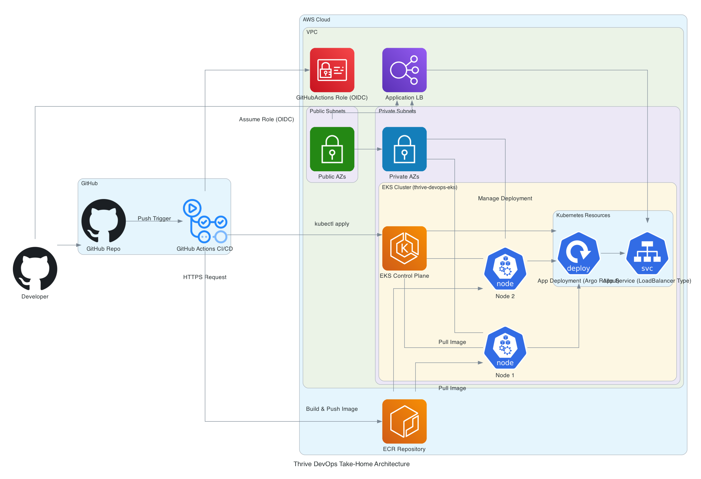

# 📐 Project Planning & Execution Strategy

This plan breaks the project into clear, layered phases — from requirement analysis through infrastructure deployment and final polish. It’s structured to reduce complexity, prevent backtracking, and support fast decision-making without cutting corners. Each phase builds on the last, helping ensure the final result is both technically sound and easy to navigate. Along the way, it leaves room for fallback strategies, traceable decisions, and documentation that actually reflects how the system works.

---

## Structural Summary: Project Flow Overview

| Phase | Step | Name                                       | Purpose                                                          |
| ----- | ---- | ------------------------------------------ | ---------------------------------------------------------------- |
|  1️⃣   | 0    | Meta-Planning                              | Decide how to decide                                             |
|       | 1A   | Requirements Analysis                      | Identify explicit + implicit requirements; detect contradictions |
|       | 1B   | Define Project Layout & Conventions        | Establish baseline repo structure, naming, and delivery intent   |
|       | 2A   | Architecture Branch Mapping                | Draft decision tree of viable infra paths                        |
|       | 2B   | Dependency & Implication Mapping           | Re-structure tree based on dependencies and constraints          |
|       | 3A   | Architecture Path Selection                | Evaluate top paths and commit                                    |
|       | 3B   | Design Validation & Feasibility Checkpoint | Confirm requirements coverage, flag risk, define fallback plans  |
|       | 3C   | Finalize Project Layout & Tooling          | Lock directories, tooling, and file structure based on design    |
|  2️⃣   | 4    | Execution Planning                         | Define build sequence, stub order, time allocation               |
|       | 5    | Execution & Delivery                       | Build (create/execute/deploy Terraform, CI/CD, etc.)             |
|  3️⃣   | 6    | Requirements Validation                    | Confirm all instructions fulfilled or explained                  |
|       | 7    | Polish, Packaging & Narrative Integration  | Finalize deliverables, inject narrative, apply finishing polish  |

---

## 🧠 Phase 1: Planning & Design

### 🧩 Step 0: Meta‑Planning  

Decide how to decide. Establish framework structure, tone guidelines, assistant directives, and planning hierarchy.

---

### 🧩 Step 1A: Requirements Analysis  

- Extract explicit, implicit, and bonus requirements into a formal checklist.  
- Treat “bonus” features as must-haves, but defer their implementation to later layers.  
- Add a **Requirements → Implications matrix** to surface how each requirement impacts design.  
- Identify contradictions (e.g., EKS billing vs. free-tier constraint) and document mitigation stance.  

---

### 🧩 Step 1B: Define Project Layout & Conventions  

This step defines the **baseline scaffolding**, naming conventions, and repo intent based on known deliverables and practices — **prior** to final architecture selection. The goal is to prepare a submission-ready layout that will evolve as technical decisions are made.

*Note: Certain elements (e.g. monitoring layout, secrets structure, k8s manifests) are deferred until architecture is locked in Step 3C.*

#### 🗂️ Repository: `thrive-devops-takehome`

This repo is submission-ready by default. All documentation, configuration, and infrastructure files will be committed directly to this repository in a structure optimized for reviewer clarity.

#### 📁 Initial Directory Structure
```bash
.
├── infra/                   # Infrastructure-as-Code (Terraform)
│   └── terraform/
├── app/                     # Application Dockerfile and runtime files
├── docs/                    # Documentation
│   ├── ADRs/                # Architecture Decision Records (RFC-style)
│   └── diagrams/            # Mermaid, draw.io, or PNG architecture sketches
├── scripts/                 # Optional shell or Python automation helpers
├── .github/                 # GitHub Actions workflows (location reserved)
│   └── workflows/
├── README.md
├── CONTRIBUTING.md
├── NOTES.md                 # Internal notes (optional)
├── EVALUATOR.md             # Guidance or context for evaluator (optional)
└── .env.example             # Safe environment variable template
```

---

### 🧩 Step 2A: Architecture Branch Mapping  

Draft a **Decision Tree** capturing major branch points across infrastructure, orchestration, CI/CD, security, and observability layers.

---

### 🧩 Step 2B: Dependency & Implication Mapping  

- Annotate the tree with:
  - Implications and trade-offs  
  - Downstream implications  
  - Dependency constraints  
  - Gotchas and failure modes  
- Restructure if earlier choices constrain downstream decisions.

---

### 🧩 Step 3A: Architecture Path Selection  

Evaluate the decision tree and commit to a single architecture path.  
- Document rationale for selected and rejected paths.
  - **Chosen Path:** Canary + EKS (Argo Rollouts)  
  - **Rationale Summary:**  
    - Progressive, metrics‑driven rollouts (phased weights, pauses, auto‑rollback)  
    - Native Kubernetes CRDs: versioned, auditable, GitOps‑friendly  
    - Seamless evolution into A/B testing via Argo experiments  
    - High “wow” factor for reviewers, transferable MLOps/DevOps skill signal  
    - Terraform + Helm + Argo stack showcases senior‑level orchestration expertise  
  - **Why Not Blue‑Green or ALB‑only Canary:** see {insert ADR}.
- Flag bonus items for potential stub/mimic if time-constrained.

---

### 🧩 Step 3B: Design Validation & Feasibility Checkpoint  

- **Primary objective:** Validate the selected architecture against the requirements checklist.
  - Confirm that each requirement is covered or explicitly deferred
  - Identify any mismatches before execution begins  
- Manually review and use LLM "red-team" prompts to ensure no requirement gaps, logic drift, or structural misalignment exist.  
- Also reassess feasibility and risk:
  - Are we confident the selected path fits within time/resources?
  - What are the riskiest moving parts?
  - Can they be stubbed or mimicked if needed?
  - Create escape hatches or fallback paths proactively  
  
---
### 🧩 Step 3C: Finalize Project Layout & Tooling  

This step finalizes the directory and tooling layout based on the confirmed architecture: **EKS + Argo Rollouts + Prometheus + GitHub Actions**.

---

#### 📁 Finalized Directory Structure
```bash
.
├── k8s/                     # Kubernetes manifests
│   ├── base/                # Core deployment specs
│   ├── rollouts/            # Argo Rollouts-specific configs
│   └── secrets/             # ExternalSecrets and K8s Secret CRs
├── monitoring/              # Prometheus rules, Grafana dashboard, alertmanager config
```

---

## 🛠️ Phase 2: Execution

### 🧩 Step 4: Execution Planning  

Break the work into **execution layers** based on:

1. **Dependency order** — what must be built first to unblock downstream work  
2. **Strategic impact** — what delivers the highest credibility and technical signal per hour of effort  

#### Layered Execution Strategy

- 🟢 **Layer 1: Must-Haves**
  - Terraform AWS infrastructure (VPC, EKS)
  - Containerized hello-world app
  - Basic Kubernetes deployment + Argo Rollouts CRD
- 🔵 **Layer 2: Strategic Core**
  - GitHub Actions CI/CD pipeline (build → push → deploy)
  - Basic monitoring and alerting (Prometheus/Grafana)
- 🟡 **Layer 3: High-Signal Extras**
  - TLS via cert-manager
  - Secrets Manager integration
  - Health checks and rollback analysis via Argo templates
- 🔴 **Optional Flair**: Bonus integrations, fun extras

---

### 🧩 Step 5: Execution & Delivery

#### 5A: Infrastructure PoC  

Provision VPC + EKS in sandbox or staging AWS account to verify Terraform/IAM setup.

#### 5B: Core Delivery  

Containerize app → deploy via Argo → verify live traffic

#### 5C: CI/CD Integration  

Build GitHub Actions pipeline: build, tag, push to ECR, deploy to EKS via `kubectl`

#### 5D: Bonus Implementation Layer  

- TLS with cert-manager  
- AWS Secrets Manager + external-secrets  
- Prometheus/Grafana + Alertmanager  
- Argo Rollouts + AnalysisTemplate  

#### 5E: Fallback & Exit Strategy  

- At the end of **Layer 2**, reassess available time. If time gets tight:
  - Stub items with clear `TODO:` markers  
  - Provide configuration placeholders and documentation  
  - Include a “What I Would Have Done” section in the README  
  - Create “what would have gone here” diagrams or explanatory blocks  
  - Write plausible log outputs, alerts, or configuration placeholders  
- This structure allows graceful degradation of scope without compromising polish or perceived completeness.
- **Minimum Viable Demo:** When EKS receives traffic + app is live, cut a GitHub release + record a 30-sec Loom or CLI demo. This becomes your fallback demo even if everything explodes later.

---

## 📦 Phase 3: Finalization

### 🧩 Step 6: Requirements Validation  

- Run the original checklist against the final output  
- Confirm which items were:
  - ✔️ Fully implemented  
  - 🚧 Stubbed with justification  
  - ❌ Skipped (out of scope or blocked)  
- Document mappings as a **“Requirements Traceability Matrix (RTM-lite)”** —  
  _“X was implemented via Y. If not, here's why.”_  

---

### 🧩 Step 7: Polish, Packaging & Narrative Integration  

- Surface all strategic decisions in a visible but natural way throughout the repo (README, comments, commit messages)  
- Finalize:
  - `README.md` with TOC, TL;DRs, and smart structure  
  - Architecture diagrams with tidy layout and consistent language  
  - Step-by-step deployment instructions  
- Integrate narrative into:
  - File names, directory structure, and diagram annotations  
  - Inline comments that explain judgment, not just mechanics  
  - README sections that tie implementation back to original requirements  
- Include polish signals:
  - Copyediting and formatting pass  
  - Comment cleanup and small “staff engineer”-style explanations  
  - Fake-but-plausible logs, alerts, and stubs  
- Consider adding:
  - `NOTES.md` or `CONTRIBUTING.md` for evaluator guidance  
  - “What we would have done” notes to narrate intent over scope

---

## 🧨 Final Risk Flags / Anti-Patterns to Avoid

| Risk                                                 | Mitigation                                                       |
| ---------------------------------------------------- | ---------------------------------------------------------------- |
| Getting stuck in Step 2 for too long                 | Timebox design iterations: 1st pass (60–90min), 2nd pass (45min) |
| Under-scoping time sinks (e.g., TLS, Canary rollout) | Flag stub/mimic strategies during Step 3B                        |
| Making a decision too early                          | Don’t lock until Step 3 is done + sanity checked                 |
| Over-polishing during execution                      | Treat final polish as its own dedicated step (Step 7)            |

---

## 🧱 Graceful Degradation Strategy

| Layer                     | Description                         | Strategy                               |
| ------------------------- | ----------------------------------- | -------------------------------------- |
| 🟢 **Must-Haves**         | Core infrastructure and app         | Build this first, validate immediately |
| 🔵 **Strategic Core**     | Monitoring, TLS, secrets mgmt       | Prioritized by signal-to-effort ratio  |
| 🟡 **High-Signal Extras** | Health checks, rollback analysis    | Add only if core+value are complete    |
| 🔴 **Optional Flair**     | “Wow” extras (e.g., career GPT bot) | Timeboxed to final 90 min if at all    |

## 📊 Architectural Diagram

